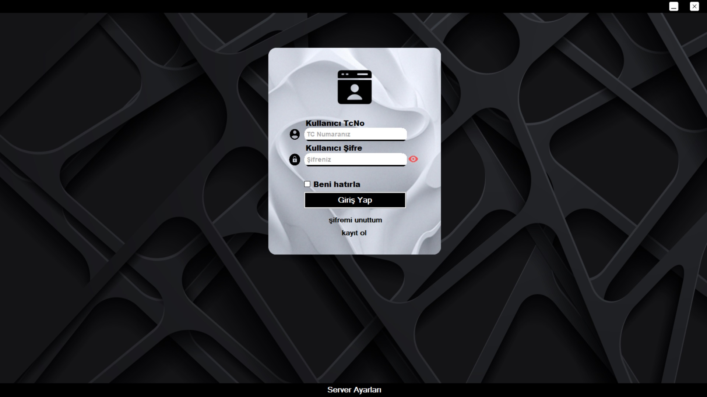
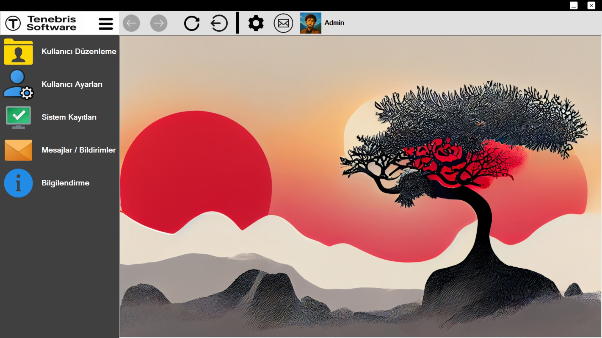
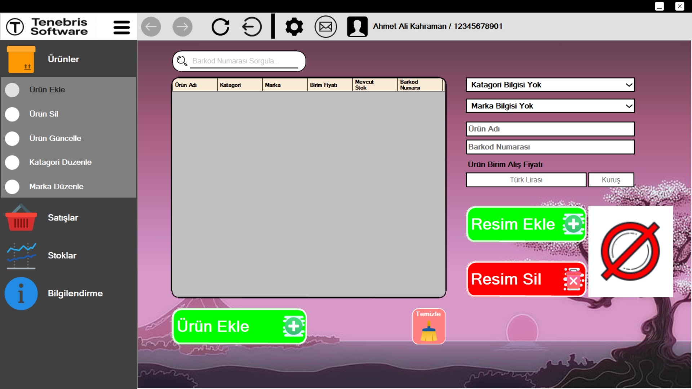

# 🛍️ Tenebris Stationary

Kırtasiye satış & stok ve lisans yönetim sistemi. SQL Server (Express) entegrasyonu ve kurulum otomasyonu içerir.

## ✨ Özellikler
- Satış, stok, müşteri yönetimi
- Lisans sistemi (cihaza bağlı lisans)
- SQL Server 2022 Express desteği
- Raporlama ve yedekleme/geri yükleme

## 🚀 Kurulum
1. **Releases** bölümünden son sürümü indir.
2. `setup.exe`’yi çalıştır. SQL Server yüklü değilse otomatik kurulur/atlanır.
3. Uygulamayı başlat ve ilk kullanıcıyı oluştur.

## 📸 Ekran Görüntüleri

## 🧰 Teknolojiler
- C# / Windows Forms
- SQL Server 2022 Express
- Inno Setup (sessiz kurulum)

## 📦 Sürümler & Değişiklikler
- Detaylar için: [CHANGELOG.md](CHANGELOG.md)

## 🗺️ Yol Haritası
- [ ] Rapor tasarımları
- [ ] Çoklu dil
- [ ] Gelişmiş lisans paneli

## 📄 Lisans
MIT License
